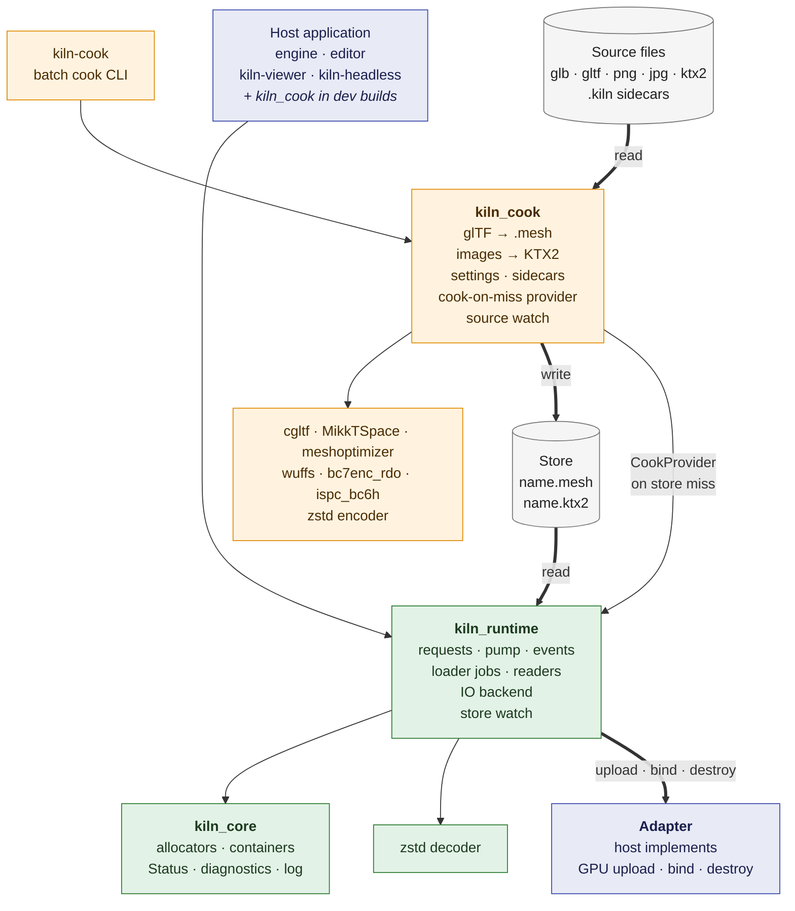
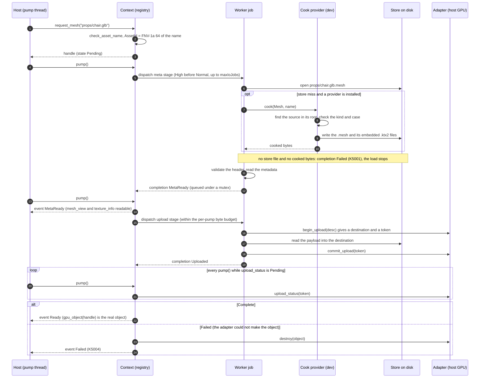
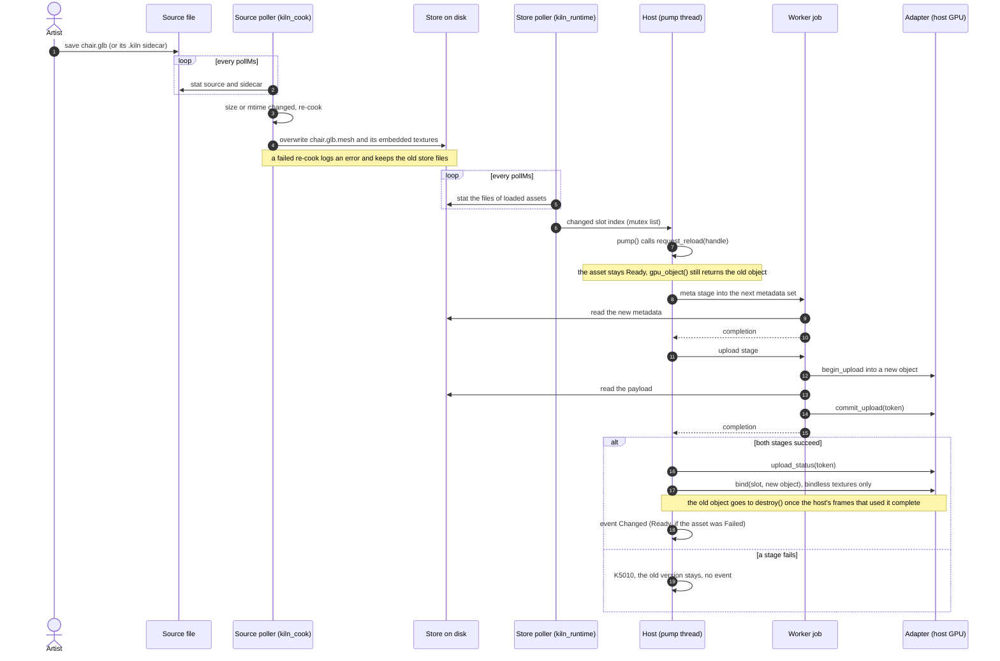

# Architecture

**Decides:** nothing. This note draws what the other design notes decide: the building blocks and
their dependencies, one asset load, and one hot reload. When a diagram and a note disagree, the
note wins; fix the diagram.

## Building blocks

Thick arrows carry asset data from the sources to the GPU. Thin arrows are link dependencies.
Green ships in a release build, orange is dev builds and tools only, blue is the host's code, grey
is files on disk.

The rules behind the picture:

- `kiln_core` depends on nothing else in kiln. `kiln_runtime` never depends on `kiln_cook`; the
  shipping build has no `kiln_cook` and no third-party code (`shipping-split.md`).
- The runtime reaches the GPU only through the host's `Adapter` (`adapter.md`). The null adapter
  serves tests and `kiln-headless`.
- The cook side joins the runtime through one function pointer, `CookProvider`. The runtime
  asks it for bytes on a store miss and knows nothing else about sources.
- One source file gives one cooked asset (`asset-model-next.md`). The store is the only thing the
  runtime reads.

## Asset load

`request_mesh` or `request_texture` on the pump thread, then `pump()` until the asset is `Ready`.
Workers run one stage of one asset per job; only `pump()` changes state and emits events
(`threading-and-io.md`, `handles-and-states.md`).

A failure at any stage ends in one `Failed` event with one K5xxx diagnostic, emitted by `pump()`.
A texture serves its placeholder until `Ready`, and after `Failed`.

## Hot reload

Two pollers that do not know each other, joined by the store on disk (`hot-reload.md`). The
source poller exists only with a cook provider and `ProviderDesc::watchSources`; the store poller
only with `KILN_HOT_RELOAD` and `ContextDesc::hotReload.watchStore`. Either one also works alone.

A host with its own file watcher, or an editor "reload" button, calls `request_reload()`
directly and starts at step 7.
