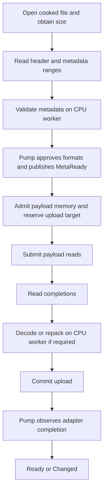

# Asynchronous cooked-asset reads

**Status:** Proposed (2026-09-29). The owner selected the cooked-asset read path as the
optimization scope; the interface and implementation below are a proposal, not implemented.
**Decides:** Explicit read submission and completion, request ownership, loader continuations,
native IOCP / io_uring backends, and the limits of the first implementation.
**Related:** [threading-and-io.md](threading-and-io.md), [adapter.md](adapter.md),
[shipping-split.md](shipping-split.md), [hot-reload.md](hot-reload.md),
[project terminology](../../CONTEXT.md).

## 1. Goal and scope

Load existing cooked assets without occupying a CPU worker while a payload read is pending.
Allow storage concurrency, CPU decoding concurrency, and GPU upload pressure to be controlled
independently. Preserve the application's request/handle/group/event model.

Included:

- Opening the cooked file, obtaining its size, metadata and payload reads, and closing the file.
- Metadata validation, decoding supported payload codecs, row repacking, and padding.
- Admission limits, priorities, short reads, cancellation, hot-reload replacement, and shutdown.
- The handoff to `Adapter::begin_upload`, `commit_upload`, and `upload_status`.
- Windows overlapped reads with IOCP; Linux reads through io_uring.
- A compatibility backend with the same asynchronous contract and dedicated blocking readers.

Excluded:

- Source import, cooking, encoding, saving cache files, and optimizing cook-provider execution.
- Redesigning store layout, adding a packfile format, or changing asset identity.
- Remote download protocols, GPU decompression, DirectStorage, and progressive mip residency.
- Direct/unbuffered IO, registered buffers/files, kernel submission polling, and universal
  zero-copy guarantees in the initial implementation.

Cook on miss remains supported through the existing provider boundary. A miss leaves the read
path, runs the provider as today, and rejoins loading with its returned bytes or published file.
Its CPU and write costs are measured separately. Memory-registered assets bypass filesystem IO.
Runtime decoding of an existing cooked payload IS in scope, even when the codec is compute-heavy.

## 2. Current implementation and required change

`IoBackend::read_range` in `include/kiln/io.h` is synchronous. The compatibility implementation
uses blocking positional reads. `src/runtime/loader.cpp` runs an entire metadata or upload stage
on a worker; local `Source` and scratch objects assume a read has finished when it returns.
The current IO-byte limiter can also put a worker to sleep while waiting for admission.

Replacing the system call inside `read_range` and waiting for its result would retain this
behavior. The new path instead keeps a persistent load attempt and resumes it after explicit
completions. Request storage, scratch buffers, and upload reservations outlive individual jobs.

The existing synchronous interface remains available to tools, cook code, and existing hosts.
The async path is additive. It must not silently change synchronous callback semantics.

## 3. Read service and threading

The initial built-in implementation has one read-service owner thread per service instance.
It submits native reads, collects completions, advances IO-only continuations, and manages its
request table. A context owns a service by default; a host can supply a service implementation.
Sharing one service across contexts requires separate logical endpoints and is not an implicit
property of passing the same backend pointer twice.

Roles:

| Role | Responsibilities |
|---|---|
| Pump thread | Asset registry, priorities, releasing handles, adapter capability checks, public events and state, dispatch of CPU jobs |
| Read service | Read admission, native submission/completion, resubmitting short reads, cancellation requests, IO-owned bookkeeping |
| File-control executor | Potentially blocking open/size/stat/close work; bounded separately from decode workers |
| CPU workers | Parse/validate metadata, decode/repack payloads, worker-safe adapter begin/commit calls |
| Adapter / pump thread | Existing GPU progress, binding, failure publication, and frame retirement contract |

Messages transfer ownership between these roles. The read service never mutates a registry
`Slot` or invokes user diagnostics. Stable request IDs identify messages; generation checks reject
stale load-attempt references. Allocator callbacks retain their existing thread-safety requirement.

Open/stat/close are explicitly a bounded blocking lane in the first release. Windows IOCP does
not turn ordinary file opening into an asynchronous operation. A later backend may implement
these operations natively, without changing the load-attempt lifecycle.

### Progress and pump boundaries

Accepted native reads progress without `pump()`. Their completions are collected by the service;
short-read continuations also run without a frame boundary. The service waits on a notification
when idle; it does not busy-poll.

For the first implementation, CPU continuations are posted to kiln's completion queue and
dispatched through the existing `JobSystem` by `pump()`. Metadata admission and adapter operations
already owned by the pump stay there. Consequently, transitions from IO to CPU work and back can
incur pump latency; this is an explicit limitation, not a claim of fully autonomous loading.
`wait()` continues pumping and therefore makes progress.

Do not invoke an arbitrary host `JobSystem::submit` on the completion collector: its existing
contract permits blocking when full. Fully background CPU continuation scheduling would require
a separate nonblocking dispatch contract and is deferred until pump-latency measurements justify
it. No public asset state or event may be published outside `pump()` in either design.

## 4. Proposed backend interface

This is an interface sketch; names and layout are not an ABI commitment. It lives alongside the
synchronous interface and contains no OS types.

```cpp
struct IoRead {
    u64 requestId;                 // nonzero, unique until its completion is consumed
    IoFile file;
    u64 offset;
    Span<u8> destination;
};

struct IoCompletion {
    u64 requestId;
    Status status;
    u64 bytesRead;
};

struct AsyncReadBackend {
    Status (*submit_read)(void* user, IoRead const& read);
    Result<usize> (*poll)(void* user, Span<IoCompletion> out);
    Status (*cancel)(void* user, u64 requestId);
    Status (*wait)(void* user, u32 timeoutMs);
    void (*wake)(void* user);
    void* user;
};
```

`submit_read`, `poll`, `cancel`, and `wait` have one owner: the read-service thread. Only `wake`
is callable concurrently, to interrupt the service when new work or shutdown arrives. The service
inbox and wake protocol must prevent a notification between the empty check and sleep from being
lost. `wait` consumes no completions and returns on completion availability, wake, timeout, or
backend failure. It cannot require a new completion to arrive if one is already queued.

The native backend factory supplies a compatible file backend as well as the read backend and
reports its execution mode (`IOCP`, `IoUring`, or `BlockingWorkers`). File handles are specific to
that pair: a handle opened by the old Windows compatibility backend, for example, is not valid
for native overlapped submission. Host-provided backends must supply a compatible pair too.
The synchronous `read_range` member remains usable by tools; the async runtime never calls it
on its CPU workers.

### Acceptance and completion

- `Ok` from `submit_read` means accepted. Exactly one terminal completion follows, including
  operations that complete immediately and operations cancelled before native submission.
- `Busy` or another submission error means not accepted: no completion follows, and the caller
  still owns the destination. Busy must not wait for another operation to finish.
- Acceptance requires reserved request/completion capacity. Completions must never be dropped
  when the pump stalls. A bounded completion queue must retain results or stop admitting work.
- The backend copies the descriptor before returning. The file and destination remain borrowed
  until the completion is consumed. Backend-private native request storage has the same lifetime.
- `poll` is nonblocking, returns at most `out.size` entries, and consumes only those entries.
  Completions may arrive in any order. Bytes become safe to inspect after their completion.
- Zero-length reads are completed locally by kiln; they are not sent to the backend. Offset/size
  overflow and invalid destinations are rejected before submission.
- `bytesRead` must not exceed the requested size. On success it may be smaller. On failure it
  describes any transferred prefix, but kiln treats the requested range as failed.
- A successful short read advances the destination/offset and submits the remainder under a new
  request ID. Zero bytes before the required range is complete becomes `IoEof`; never retry forever.
- `poll` failure is service failure, not an asset's read error. Stop admission, report the service
  failure once, and drain or otherwise establish quiescence for every accepted request. A fatal
  service error alone is never proof that borrowed destinations can be freed.

Submission does not deliberately wait for read completion. This is not a hard upper bound on
native syscall latency: buffered filesystem operations can still do work during submission.
Keeping submission on the read service protects the pump and CPU worker pool from that latency.

The first backend submits requests promptly. Batching is an internal optimization and may not
leave an accepted request waiting indefinitely for another request or another pump.

## 5. Load attempts and file consistency

Each attempt owns its file, immutable metadata snapshot, IO requests, scratch allocations, and
optional upload target until those resources have no users. A handle release marks the attempt
abandoned; it does not recycle the attempt's storage while requests or jobs reference it.



The diagram describes a successful first load. Header-dependent metadata reads can take multiple
steps. Reloads preserve the current event rules and keep the previous successful payload available;
they do not publish an intermediate `MetaReady`. Backend or decode failure follows existing
asset-load diagnostics; a failed reload preserves the old version.

Retain the same open file through metadata and payload reads. This avoids reopening a newer file
after validating an older file's metadata, and permits atomic rename replacement while loading.
It does not make in-place mutation a snapshot. Store producers must publish immutable files by
replacement; format validation still handles truncation/corruption. Changed files start new attempts
through existing reload scheduling. File count is budgeted to bound the cost of retaining handles.

### Destinations and adapter ownership

- Raw mesh data and matching texture layouts may read directly into adapter-provided writable
  memory when the backend supports that destination. Successful `begin_upload` grants exclusive
  write use until commit under the existing adapter contract.
- The initial guaranteed path is ordinary CPU scratch memory. Direct reads into mapped GPU/staging
  memory require platform validation and an explicit backend capability; they are not assumed safe
  merely because a pointer is CPU-addressable. Unsupported destinations use scratch plus a copy.
- Compressed payloads use encoded scratch and decode into the final upload target. Padded texture
  rows use scratch/repacking where necessary; do not issue an IO request for every row by default.
- No commit, destruction, or staging reuse while an IO request or CPU job can still write its range.
- Preserve the current adapter ticket contract: after successful begin, commit exactly once, even
  on an abandoned/failed load, then let kiln drain the upload and destroy its object. This occurs
  only after all writers finish. An adapter discard callback is a separate improvement, not a
  prerequisite hidden in this spec.

On the scratch path, prefer acquiring the upload target after reads finish to avoid holding GPU
staging space during storage stalls. Budget the temporary coexistence of encoded scratch, decoded
data, and the target; do not assume the on-disk size bounds decoded memory.

## 6. Admission and back-pressure

Separate configuration/metrics for:

- Active load attempts and open files.
- Outstanding read requests and the sum of their destination byte ranges.
- Retained CPU scratch bytes, including completed reads waiting for decode.
- CPU jobs queued/running; existing upload-per-pump admission and adapter staging limits.

The current `maxIoJobs` remains meaningful for the compatibility path; do not silently reinterpret
it as every new limit. Proposed async settings get their own descriptor. Existing `ioInFlightBytes`
can cap outstanding read bytes, but it does not account for scratch retained after completion.

Admission precedes submission and runs through ready queues. No CPU worker sleeps waiting for
an IO budget. A failed attempt releases permits only as ownership ends, not at handle release.
Avoid holding an upload target while waiting for scratch needed to finish that same upload.

Split large range reads into bounded chunks. Multiple chunks may be outstanding for disjoint
destinations. A file can exceed the read-byte budget; it progresses through chunks. If a decoder
requires an indivisible scratch allocation above its budget, fail with a clear resource-limit
diagnostic instead of waiting for impossible capacity. An upload larger than the adapter can ever
accept must likewise fail, while temporary pressure remains retryable.

Priority changes affect unsubmitted work. Native requests already in flight are not assumed
preemptible. High-priority work receives preference with a bounded fairness rule so normal loads
eventually progress. Initial constants and defaults are selected with benchmarks, not baked into
the public contract. Ring saturation and full long-lived heaps are reported distinctly.

## 7. Cancellation and shutdown

`cancel` is advisory. Success means the cancellation request was registered, not that the
destination is safe to release. Busy means retry later; an already finishing operation may still
complete successfully. The original request produces one completion whichever outcome wins.
Backend cancellation-operation completions (such as io_uring cancel CQEs) are internal and must
not appear as duplicate read completions.

When an attempt is abandoned: stop submitting its remaining ranges, request cancellation where
supported, consume all accepted completions, join its CPU continuations, and retire its resources.
The attempt generation prevents late messages from affecting a reused asset slot. An unsupported
cancel operation falls back to letting the read finish.

Shutdown sequence:

1. Stop admission and prevent new continuations from launching work.
2. Cancel/drain reads and file-control tasks while keeping the service running.
3. Finish CPU jobs and reconcile their messages; no producer may still reference context memory.
4. Finalize outstanding adapter tickets and complete their uploads; retain the existing host
   requirement that rendering uses have finished before GPU object destruction.
5. Close retained files, stop/join owned service threads, and free request/attempt tables.

The backend and supplied allocator outlive this sequence. A timeout is diagnostic information,
not permission to free memory the OS might still access. Initial destruction may block on stalled
storage, just as existing destruction can wait for workers. An asynchronous context-destruction
API is out of scope. Host GPU-idle waiting does not cover new uploads committed during draining;
those still require adapter completion before their resources are destroyed.

## 8. Platform mapping, selection, and build boundaries

**Windows:** open compatible handles with overlapped mode, associate them with IOCP, and retain
one native request record per outstanding read. Normalize immediate success, immediate error,
queued completion, short reads, and cancellation into the acceptance contract above. Do not
configure success-notification suppression without providing the missing logical completion.
Wake packets must be distinguishable from read completions.

**Linux:** use ordinary buffered positional reads through io_uring, with request IDs in user data.
Start with single-shot reads and ordinary submission, with explicit SQ/CQ capacity handling.
Cancellation CQEs and read CQEs have separate internal identities. Runtime initialization probes
availability; an installed kernel version alone does not guarantee permission to use io_uring.

**Compatibility:** dedicated blocking readers implement the same submit/completion contract.
They never consume the host's general CPU job workers merely to wait on storage. Cancellation
may only suppress work not yet started. Other platforms can use this mode initially.

Proposed selection: `Compatibility`, `Auto`, or `NativeRequired`. Preserve compatibility as the
initial default. Auto may fall back at service creation and reports the selected backend/reason;
NativeRequired reports initialization failure. Never silently switch backends with requests in
flight or migrate handles between incompatible providers.

Build the native backends optionally with kiln_runtime; all modes remain read-only and usable
with `KILN_BUILD_COOK=OFF`. No example/window dependencies enter the runtime. The current
shipping dependency policy admits third-party decoders only: using liburing would need an
explicit policy exception. The proposed initial Linux implementation uses a small private
kernel-ABI wrapper; compare maintenance cost with liburing during its implementation milestone
before committing to either dependency choice. The read contract is independent of that choice.

## 9. Validation and performance gates

First implement a deterministic fake async backend that exercises:

- Immediate and delayed completion, arbitrary order, successful short reads, EOF, and failures.
- Busy with no acceptance; completion capacity exhausted while the pump pauses.
- Cancel before submission, during IO, after completion, and unsupported cancellation.
- Release/re-request and reload with late completions; generation reuse and stale messages.
- Shutdown with outstanding reads, CPU jobs, file operations, and adapter uploads.
- A file replaced between metadata and payload reads; separate in-place corruption cases.
- Saturated scratch/read/staging budgets, large chunked reads, and permanent capacity failure.

Use guarded/tracked destinations to establish that no writer survives reclamation. Run sanitizer
coverage where available. Native integration tests verify the same behavior, plus fallback and
NativeRequired behavior. Test direct-to-staging separately for each supported backend/adapter
pair; scratch remains the valid fallback. Existing golden payloads and event/reload tests must
continue to pass, including shipping builds and the synchronous backend.

Benchmark existing blocking workers, dedicated compatibility readers, and native async reads on
the same pre-cooked corpus: many small assets, a few large assets, mixed priorities, warm/cold
cache runs (record how coldness is established), and a host with a constrained worker pool.
Exclude cook-on-miss and cache writes from read-path timing.

Report time-to-MetaReady/Ready (including tail latency), throughput, outstanding IO depth,
CPU-worker occupancy, time in open/stat/read/decode/adapter stages, pump-boundary delays,
peak scratch/staging bytes, and cancellation/shutdown drain time. Compare with equal resource
budgets. No claimed speedup without measurement; choosing a native backend by default requires
evidence of benefit and no material regression for warm-cache loads.

## 10. Delivery sequence and remaining decisions

1. Add stage timing and a reproducible cooked-asset load benchmark.
2. Implement persistent load attempts, the async contract, fake backend, and bounded compatibility
   service. Prove ownership/cancellation before native integration.
3. Add IOCP and its platform tests; validate ordinary scratch destinations first.
4. Add io_uring and its platform tests, resolving the wrapper/liburing policy choice explicitly.
5. Validate direct-to-staging opportunities, tune budgets, and compare all modes.

No additional owner decision is required to draft this design. Before implementation, review the
proposed service/thread ownership and pump-boundary limitation. Before enabling native mode by
default, use measurements to choose defaults. Extending CPU dispatch, adding asynchronous file
control, or adding GPU-specific IO remains a separately justified change.

## Sources

- [Windows IO completion ports](https://learn.microsoft.com/en-us/windows/win32/fileio/i-o-completion-ports): completion delivery and native request lifetime.
- [Windows cancellation](https://learn.microsoft.com/en-us/windows/win32/fileio/canceling-pending-i-o-operations): cancellation does not establish completion.
- [Linux io_uring](https://man7.org/linux/man-pages/man7/io_uring.7.html): submission/completion queues, request correlation, and ordering.
