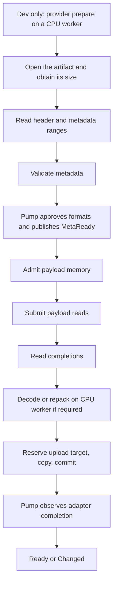

# Asynchronous cooked-asset reads

**Status:** Proposed (2026-09-29), revised 2026-10-04 after a review against the code. Nothing here
is implemented. The note is now two parts with separate sign-off:

- **Part 1, load attempts** (proposed for v0.8): the load benchmark, persistent load attempts, the
  read contract, a fake backend and dedicated blocking readers.
- **Part 2, native backends** (v0.9, on hold): IOCP and io_uring. They wait until the Part 1
  benchmark shows that blocking readers are not enough.

**Decides:** Explicit read submission and completion, request ownership, loader continuations, and
what must be measured before a native backend is built.
**Related:** [threading-and-io.md](threading-and-io.md), [adapter.md](adapter.md),
[shipping-split.md](shipping-split.md), [hot-reload.md](hot-reload.md),
[store-manifest.md](store-manifest.md). Open points: `../open-questions.md` R24.

Terms: the **read path** is the work to load an existing cooked asset: read, validate, decode,
upload. A **load attempt** is one attempt to obtain one version of an asset. A reload is a new
attempt; the previous successful version stays available.

## 1. Goal and scope

Load existing cooked assets without occupying a CPU worker while a payload read is pending.
Allow storage concurrency, CPU decoding concurrency, and GPU upload pressure to be controlled
independently. Preserve the application's request/handle/group/event model.

Included:

- Opening the cooked file, obtaining its size, metadata and payload reads, and closing the file.
- Metadata validation, decoding supported payload codecs, row repacking, and padding.
- Admission limits, priorities, short reads, cancellation, hot-reload replacement, and shutdown.
- The handoff to `Adapter::begin_upload`, `commit_upload`, `discard_upload` and `upload_status`.
- Part 1: dedicated blocking readers behind the asynchronous contract.
- Part 2: Windows overlapped reads with IOCP; Linux reads through io_uring.

Excluded:

- Source import, cooking, encoding, saving cache files, and optimizing cook-provider execution.
- Redesigning store layout, adding a packfile format, or changing asset identity.
- Remote download protocols, GPU decompression, DirectStorage, and progressive mip residency.
- Direct/unbuffered IO, registered buffers/files, kernel submission polling, and universal
  zero-copy guarantees in the initial implementation.

Memory-registered assets bypass filesystem IO. Runtime decoding of an existing cooked payload IS in
scope, even when the codec is compute-heavy. The cook provider's place is in §3.3.

### Cost against the library's size

The runtime is about 3,900 lines (`src/runtime/`). A read-service thread, a file-control executor,
two native backends and a compatibility service together are a large addition. The measured
problem so far is one: a CPU worker is occupied while a read is pending, and the IO-byte limiter
can put a worker to sleep. Dedicated blocking readers remove both. A native backend needs its own
evidence (§9).

## 2. Current implementation and required change

`IoBackend::read_range` in `include/kiln/io.h` is synchronous. The compatibility implementation
uses blocking positional reads. `src/runtime/loader.cpp` runs two worker jobs per load attempt:

- **Meta job:** with a cook provider installed, call its `prepare` (§3.3); open the artifact, read
  and validate the metadata, close the artifact. A texture array does this for every layer.
- **Upload job:** `begin_upload`, open the artifact again, read, decode, then `commit_upload`, or
  `discard_upload` if a read or decode failed.

Local `Source` and scratch objects assume a read has finished when it returns. The `IoBytes`
limiter waits on a worker when `ioInFlightBytes` is used up.

Facts the first version of this note did not have:

- **Artifacts are immutable** and named by build key. The key is chosen at dispatch
  (`JobOutput::key`). Opening the artifact a second time cannot return other content.
- **`Adapter::discard_upload` exists** (optional). A failed load after `begin_upload` no longer has
  to commit.
- **Compressed payloads decode into scratch memory**, then one copy goes to the upload target.
  Zstd reads its own output back, and staging memory is often write-combined: decoding into it was
  about 10 times slower (`cook-tracing.md`, "First findings").
- **A texture array reads up to 2048 artifacts** in one attempt, one after another.
- **Direct reads are the smaller case.** Meshes cook with Meshopt by default, and textures with
  Zstd where it saves 10% of the file. A read goes straight into adapter memory only for a raw
  mesh, and for a texture level that Zstd skipped and whose row pitch needs no padding.

Replacing the system call inside `read_range` and waiting for its result would keep a worker
occupied. The new path keeps a persistent load attempt and resumes it after explicit completions.
Request storage, scratch buffers, and upload reservations outlive individual jobs.

The existing synchronous interface remains available to tools, cook code, and existing hosts.
The async path is additive. It must not silently change synchronous callback semantics.

# Part 1: load attempts (proposed for v0.8)

v0.8 needs this part for its own reasons: `State::Partial` and range reads load one asset in
several steps, so the attempt must outlive a job.

## 3. Load attempts

Each attempt owns its artifact key (per layer for an array), immutable metadata snapshot, IO
requests, scratch allocations, and optional upload target until those resources have no users.
A handle release marks the attempt abandoned; it does not recycle the attempt's storage while
requests or jobs reference it. The slot's `JobInput` / `JobOutput` (R8) are the starting point.



The diagram describes a successful first load. Header-dependent metadata reads can take multiple
steps. Reloads preserve the current event rules and keep the previous successful payload available;
they do not publish an intermediate `MetaReady`. Backend or decode failure follows existing
asset-load diagnostics; a failed reload preserves the old version.

### 3.1 Files

An attempt does **not** need to keep one file open from metadata to payload. The build key fixes
the content, so a second open reads the same bytes. If `kiln-cook --gc` removes the artifact
between the two opens, the load fails as it does today (K5003).

Keeping the file open is an optimization: it saves one open per asset. Decide it with the
benchmark. If kept, it is bounded: an array attempt holds at most a few layer files open at once,
never one per layer. An open-file budget is needed only in that case.

In-place mutation of an artifact is still not a snapshot. Store producers publish immutable files
by replacement; format validation handles truncation and corruption.

### 3.2 Texture arrays

An array attempt has many inputs. Its metadata step reads every layer's header and checks it
against layer 0. Its payload step reads every layer into one upload. The attempt keeps a per-layer
level table (`ArrayLayer::src`), as today. Layers are independent reads into disjoint ranges, so
they are the best case for concurrent reads; the benchmark has an array case (§9). A failed layer
fails the attempt and cancels the reads not yet submitted.

### 3.3 Cook provider

In dev builds the provider's `prepare` runs before every load of a file asset, hit or miss, and
once per array layer. It does blocking stats, sometimes hashing, and on a miss a cook that takes
seconds and splits its work over the job system.

`prepare` is the first step of an attempt and runs on a **CPU worker**, as today. It never runs on
a reader or on the read-service thread. It returns a build key, which the read path then opens, or
cooked bytes, which make the attempt a memory source and bypass IO. Its time is measured apart
from the read path. Shipping builds have no provider and skip the step.

### 3.4 Destinations and adapter ownership

- **Scratch is the main path.** Compressed payloads read into encoded scratch, decode into decoded
  scratch, and go to the upload target with one copy. Padded texture rows repack from scratch.
  Do not issue an IO request for every row.
- **Direct reads are an optimization for the smaller case** (§2): a raw mesh, or a texture level
  without Zstd and without row padding. A direct read into mapped GPU or staging memory needs an
  explicit backend capability and platform validation. A CPU-addressable pointer is not proof.
  Without the capability, read into scratch and copy.
- On the scratch path, acquire the upload target after the reads and the decode finish. This keeps
  GPU staging space free during storage stalls.
- Budget the temporary coexistence of encoded scratch, decoded data, and the target. The on-disk
  size does not bound decoded memory.
- No commit, discard, destruction, or staging reuse while an IO request or CPU job can still write
  its range.
- After a successful `begin_upload`, kiln calls exactly one of `commit_upload` and
  `discard_upload`, after all writers finish. An abandoned or failed attempt discards. Without
  `discard_upload` it commits, then kiln drains the upload and destroys the object (`adapter.md`).

### 3.5 Pump boundaries: a risk to the goal

Today a first load crosses the pump three times: dispatch to the meta job, `MetaReady` to the
upload job, and the adapter's completion. One job does open, read and validate.

CPU continuations are posted to kiln's completion queue and dispatched through the existing
`JobSystem` by `pump()`. If every hop from IO to CPU work waits for a pump, a small asset pays
several extra frames to reach `Ready`. That makes the common case slower, which defeats the goal.

Rules for Part 1:

- **The metadata step stays one unit.** One reader opens, reads the header and metadata, and
  validates them, as the meta job does now. Metadata is small; splitting it gains nothing.
- **A payload with no CPU work has no CPU hop.** A direct read completes, then the pump commits.
- **A payload with CPU work has one hop**, from the last read completion to the decode job.
- The benchmark reports pumps and time from request to `MetaReady` and to `Ready`, per asset size
  class, against today's loader (§9). A regression for small assets blocks the change.

Do not invoke an arbitrary host `JobSystem::submit` from a completion collector: its contract
permits blocking when full. Fully background CPU dispatch needs a separate nonblocking contract and
waits until the measurements ask for it. No public asset state or event is published outside
`pump()`. `wait()` continues pumping and therefore makes progress.

## 4. Proposed backend interface

This is an interface sketch; names and layout are not an ABI commitment. It lives alongside the
synchronous interface and contains no OS types. It replaces the earlier idea of a completion token
on `IoBackend::read_range` (`threading-and-io.md`, "Path to true async IO").

```cpp
struct IoRead {
    u64 requestId;                 // nonzero, unique until its completion is consumed
    IoFile file;
    u64 offset;
    Span<u8> destination;
};

struct IoCompletion {
    u64 requestId;
    Status status;
    u64 bytesRead;
};

struct AsyncReadBackend {
    Status (*submit_read)(void* user, IoRead const& read);
    Result<usize> (*poll)(void* user, Span<IoCompletion> out);
    Status (*cancel)(void* user, u64 requestId);
    Status (*wait)(void* user, u32 timeoutMs);
    void (*wake)(void* user);
    void* user;
};
```

`submit_read`, `poll`, `cancel`, and `wait` have one owner thread. Only `wake` is callable
concurrently, to interrupt the owner when new work or shutdown arrives. The owner's inbox and wake
protocol must prevent a notification between the empty check and sleep from being lost. `wait`
consumes no completions and returns on completion availability, wake, timeout, or backend failure.
It cannot require a new completion to arrive if one is already queued.

Which thread is the owner is an open point (§11): the pump thread is enough for blocking readers;
a native backend needs a read-service thread (§8).

A backend factory supplies a compatible file backend as well as the read backend and reports its
execution mode (`BlockingWorkers`, later `IOCP` or `IoUring`). File handles are specific to that
pair. Host-provided backends must supply a compatible pair too. The synchronous `read_range`
member remains usable by tools; the async runtime never calls it on its CPU workers.

### Acceptance and completion

- `Ok` from `submit_read` means accepted. Exactly one terminal completion follows, including
  operations that complete immediately and operations cancelled before native submission.
- `Busy` or another submission error means not accepted: no completion follows, and the caller
  still owns the destination. Busy must not wait for another operation to finish.
- Acceptance requires reserved request/completion capacity. Completions must never be dropped
  when the pump stalls. A bounded completion queue must retain results or stop admitting work.
- The backend copies the descriptor before returning. The file and destination remain borrowed
  until the completion is consumed. Backend-private native request storage has the same lifetime.
- `poll` is nonblocking, returns at most `out.size` entries, and consumes only those entries.
  Completions may arrive in any order. Bytes become safe to inspect after their completion.
- Zero-length reads are completed locally by kiln; they are not sent to the backend. Offset/size
  overflow and invalid destinations are rejected before submission.
- `bytesRead` must not exceed the requested size. On success it may be smaller. On failure it
  describes any transferred prefix, but kiln treats the requested range as failed.
- A successful short read advances the destination/offset and submits the remainder under a new
  request ID. Zero bytes before the required range is complete becomes `IoEof`; never retry forever.
- `poll` failure is service failure, not an asset's read error. Stop admission, report the service
  failure once, and drain or otherwise establish quiescence for every accepted request. A fatal
  service error alone is never proof that borrowed destinations can be freed.

Submission does not deliberately wait for read completion. This is not a hard upper bound on
native syscall latency: buffered filesystem operations can still do work during submission.

A backend submits requests promptly. Batching is an internal optimization and may not leave an
accepted request waiting indefinitely for another request or another pump.

## 5. Blocking readers

The Part 1 backend is a small set of dedicated reader threads behind the §4 contract. They never
use the host's CPU job workers to wait on storage. A reader opens, reads and closes, so Part 1
needs no separate file-control executor. A reader finishes a short read itself. Cancellation only
suppresses work not yet started. Other platforms use this mode too.

`ContextDesc::maxIoJobs` keeps its meaning for the existing path. The reader count gets its own
setting.

## 6. Admission and back-pressure

Separate configuration/metrics for:

- Active load attempts, and open files if §3.1 keeps them.
- Outstanding read requests and the sum of their destination byte ranges.
- Retained CPU scratch bytes, including completed reads waiting for decode.
- CPU jobs queued/running; existing upload-per-pump admission and adapter staging limits.

Do not silently reinterpret `maxIoJobs` as every new limit. Proposed async settings get their own
descriptor. Existing `ioInFlightBytes` can cap outstanding read bytes, but it does not account for
scratch retained after completion.

Admission precedes submission and runs through ready queues. No CPU worker sleeps waiting for
an IO budget. A failed attempt releases permits only as ownership ends, not at handle release.
Avoid holding an upload target while waiting for scratch needed to finish that same upload.

Split large range reads into bounded chunks. Multiple chunks may be outstanding for disjoint
destinations. A file can exceed the read-byte budget; it progresses through chunks. If a decoder
requires an indivisible scratch allocation above its budget, fail with a clear resource-limit
diagnostic instead of waiting for impossible capacity. An upload larger than the adapter can ever
accept must likewise fail, while temporary pressure remains retryable.

Priority changes affect unsubmitted work. Requests already in flight are not assumed preemptible.
High-priority work receives preference with a bounded fairness rule so normal loads eventually
progress. Initial constants and defaults are selected with benchmarks, not baked into the public
contract.

## 7. Cancellation and shutdown

`cancel` is advisory. Success means the cancellation request was registered, not that the
destination is safe to release. Busy means retry later; an already finishing operation may still
complete successfully. The original request produces one completion whichever outcome wins.
Backend cancellation-operation completions (such as io_uring cancel CQEs) are internal and must
not appear as duplicate read completions.

When an attempt is abandoned: stop submitting its remaining ranges, request cancellation where
supported, consume all accepted completions, join its CPU continuations, discard its upload target
if it has one, and retire its resources. The attempt generation prevents late messages from
affecting a reused asset slot. An unsupported cancel operation falls back to letting the read
finish.

Shutdown sequence:

1. Stop admission and prevent new continuations from launching work.
2. Cancel/drain reads and file tasks while keeping the readers running.
3. Finish CPU jobs and reconcile their messages; no producer may still reference context memory.
4. Finalize outstanding adapter tickets (discard, or commit and complete); retain the existing host
   requirement that rendering uses have finished before GPU object destruction.
5. Close retained files, stop/join owned threads, and free request/attempt tables.

The backend and supplied allocator outlive this sequence. A timeout is diagnostic information,
not permission to free memory the OS might still access. Initial destruction may block on stalled
storage, just as existing destruction can wait for workers. An asynchronous context-destruction
API is out of scope. Host GPU-idle waiting does not cover new uploads committed during draining;
those still require adapter completion before their resources are destroyed.

# Part 2: native backends (v0.9, on hold)

Build nothing here until the Part 1 benchmark shows that blocking readers limit throughput or
latency on a real workload (§9). The contract in §4 and §7 is written so that a native backend
fits without changing the load-attempt lifecycle.

## 8. Read service, platforms and selection

### Read service and threading

A native backend needs one read-service owner thread per service instance. It submits native
reads, collects completions, advances IO-only continuations (short reads), and manages its request
table. It waits on a notification when idle; it does not busy-poll. A context owns a service by
default; a host can supply a service implementation. Sharing one service across contexts requires
separate logical endpoints.

| Role | Responsibilities |
|---|---|
| Pump thread | Asset registry, priorities, releasing handles, adapter capability checks, public events and state, dispatch of CPU jobs |
| Read service | Read admission, native submission/completion, resubmitting short reads, cancellation requests, IO-owned bookkeeping |
| File-control executor | Potentially blocking open/size/stat/close work; bounded separately from decode workers |
| CPU workers | Provider `prepare`, parse/validate metadata, decode/repack payloads, worker-safe adapter begin/commit/discard calls |
| Adapter / pump thread | Existing GPU progress, binding, failure publication, and frame retirement contract |

Messages transfer ownership between these roles. The read service never mutates a registry
`Slot` or invokes user diagnostics. Stable request IDs identify messages; generation checks reject
stale load-attempt references. Allocator callbacks retain their existing thread-safety requirement.

Open/stat/close are a bounded blocking lane. Windows IOCP does not turn ordinary file opening into
an asynchronous operation. A later backend may implement these operations natively.

### Platform mapping

**Windows:** open compatible handles with overlapped mode, associate them with IOCP, and retain
one native request record per outstanding read. Normalize immediate success, immediate error,
queued completion, short reads, and cancellation into the acceptance contract above. Do not
configure success-notification suppression without providing the missing logical completion.
Wake packets must be distinguishable from read completions. A handle opened by the blocking
backend is not valid for overlapped submission.

**Linux:** use ordinary buffered positional reads through io_uring, with request IDs in user data.
Start with single-shot reads and ordinary submission, with explicit SQ/CQ capacity handling.
Cancellation CQEs and read CQEs have separate internal identities. Runtime initialization probes
availability; an installed kernel version alone does not guarantee permission to use io_uring.
Ring saturation and full long-lived heaps are reported distinctly.

### Selection and build

Proposed selection: `Compatibility`, `Auto`, or `NativeRequired`. Preserve compatibility as the
default. Auto may fall back at service creation and reports the selected backend/reason;
NativeRequired reports initialization failure. Never silently switch backends with requests in
flight or migrate handles between incompatible providers.

Build the native backends optionally with kiln_runtime; all modes remain read-only and usable
with `KILN_BUILD_COOK=OFF`. No example/window dependencies enter the runtime. The current
shipping dependency policy admits third-party decoders only: using liburing would need an
explicit policy exception. The proposed Linux implementation uses a small private kernel-ABI
wrapper; compare maintenance cost with liburing before committing to either. The read contract is
independent of that choice.

# Both parts

## 9. Validation and performance gates

### Benchmark first

Build the benchmark before any loader change. It runs today's loader, then each later mode, on the
same pre-cooked corpus with equal resource budgets:

- many small assets; a few large assets; a texture array with many layers; mixed priorities;
- default cook settings (Meshopt meshes, Zstd textures) and a raw corpus, with the share of direct
  reads reported for each;
- warm and cold cache runs (record how coldness is established);
- a host with a constrained worker pool;
- a pump at a fixed frame rate, so pump-boundary delay shows.

Exclude cook-on-miss, provider `prepare` and cache writes from read-path timing.

Report time and pump count to `MetaReady` and `Ready` (including tail latency) per size class,
throughput, outstanding IO depth, CPU-worker occupancy, time in open/stat/read/decode/copy/adapter
stages, peak scratch and staging bytes, and cancellation/shutdown drain time.

Gates:

- **Part 1 lands** only with no regression in time-to-`Ready` for small assets and warm-cache
  loads against today's loader.
- **Part 2 starts** only if blocking readers show a measured limit that a native backend removes.
- A native backend becomes the default only with evidence of benefit and no material regression
  for warm-cache loads. No claimed speedup without measurement.

### The benchmark as built (2026-10-04)

`tests/bench_load.cpp` (`kiln_bench_load`, run by hand like `kiln_bench_image`) loads every entry
of one profile of a cooked store through the null adapter, with a new context per run and a pump
at a fixed rate. It takes its numbers from the profile hooks; the loader gained the zones
`kiln.open`, `kiln.read`, `kiln.decode` and `kiln.copy` for it (`cook-tracing.md`).

It reports, per artifact size class and per priority: time and pump count to `MetaReady` and
`Ready` (p50, p95, max). For the run: time per stage, the share of worker time that jobs use, the
share of job time in reads, opens, decodes and copies, the most reads in flight, the uploads that
read straight into the target, and peak scratch and payload bytes. `--array N` adds one texture
array of N layers; `--threads` gives the constrained pool; `--pitch` makes rows repack.

It does not empty the file cache. On Windows, `tests/purge_file_cache.ps1 -Dir <store>` drops the
cached pages of a store without admin rights; on Linux, drop the page cache. Pass `--no-probe` for a
cold run, so the benchmark reads no header first. Cancellation and shutdown drain time wait for
step 2.

### Baseline (2026-10-04)

Corpus: the Khronos glTF sample models (148 of 150 cook) and `examples/assets`, cooked with the
defaults at `--quality fast`: 891 assets (154 meshes, 737 textures), 712 MiB, profile `compat`.
Machine: i7-9700K, 32 GB, NVMe SSD, Windows, MSVC release, 7 workers, pump at 60 Hz unless noted.
"Cold" purges the store's cached pages before the run. Times are for all 891 assets.

| Run | Wall | Pumps | `Ready` p50 | Workers busy | Job time in reads |
|---|---|---|---|---|---|
| Defaults, warm | 4.38 s | 264 | 2.17 s | 12% | 7% |
| Defaults, cold | 4.40 s | 265 | 2.18 s | 14% | 27% |
| Defaults, warm, 240 Hz | 1.49 s | 358 | 0.70 s | 33% | 7% |
| `maxIoJobs` 1024, warm | 0.90 s | 55 | 0.33 s | 61% | 7% |
| `maxIoJobs` 1024, upload budget 1 GiB, cold | 1.02 s | 62 | 0.45 s | 71% | 26% |
| 2 workers, defaults, warm | 15.30 s | 919 | 7.87 s | 10% | 6% |
| 2 workers, `maxIoJobs` 1024, upload budget 1 GiB, warm | 1.53 s | 93 | 1.10 s | 98% | 6% |
| 2 workers, `maxIoJobs` 1024, upload budget 1 GiB, cold | 1.90 s | 115 | 1.37 s | 99% | 25% |

What the numbers say:

- **Today's limit is the dispatch rule, not the reads.** `pump()` starts at most `maxIoJobs` jobs,
  and the default is the worker count. A job takes 1 to 4 ms, so the workers finish and then wait
  for the next pump: 7 jobs per 16.7 ms. A cold and a warm cache give the same 4.4 s. A larger
  `maxIoJobs` lets the pool queue the jobs and cuts the load to 0.9 s (R26).
- **Reads are the smaller part of a job.** Warm: 7% of the job time. Cold, on this NVMe drive: 26%.
  Decodes are 28 to 38% and copies 7 to 14%. Reads that occupy no worker can give back at most
  that quarter, and only when the workers are the limit (the last two rows). No slow drive was
  measured.
- **Small assets wait in the queue.** With the defaults a small asset reaches `MetaReady` after
  2.2 s (p50), all of it queue time. With `maxIoJobs` 1024 it is 17 ms, one pump. The §3.5 gate
  must compare against that configuration, not against the defaults.
- **Direct reads:** 78 of 891 uploads read straight into the target. The other 813 decode or copy.
- **A 64-layer array** (one job) is `Ready` after 117 ms: 92 ms in the upload job, 65% of it in
  decodes. Its layers run one after another on one worker. Splitting the job would help it; reads
  that occupy no worker would not.
- **Memory:** scratch peaks at 79 to 103 MiB. `maxIoJobs` 1024 does not raise it, because scratch
  lives only while a job runs.

Consequence for this note: the benchmark gives no reason for Part 2 on this machine. Part 1 stays
justified by v0.8 (range reads and `State::Partial` need a persistent attempt), not by throughput.
The first gain is R26, which needs no new design.

### Tests

First implement a deterministic fake async backend that exercises:

- Immediate and delayed completion, arbitrary order, successful short reads, EOF, and failures.
- Busy with no acceptance; completion capacity exhausted while the pump pauses.
- Cancel before submission, during IO, after completion, and unsupported cancellation.
- Release/re-request and reload with late completions; generation reuse and stale messages.
- Shutdown with outstanding reads, CPU jobs, file operations, and adapter uploads.
- An artifact removed between the metadata and payload opens; separate in-place corruption cases.
- An array with a failing layer; an abandoned attempt that discards its upload.
- Saturated scratch/read/staging budgets, large chunked reads, and permanent capacity failure.

Use guarded/tracked destinations to establish that no writer survives reclamation. Run sanitizer
coverage where available. Native integration tests (Part 2) verify the same behavior, plus fallback
and NativeRequired behavior. Test direct-to-staging separately for each supported backend/adapter
pair; scratch remains the valid fallback. Existing golden payloads and event/reload tests must
continue to pass, including shipping builds and the synchronous backend.

## 10. Delivery sequence

Part 1 (v0.8):

1. Stage timing and the load benchmark (§9). **Done 2026-10-04** (`kiln_bench_load`, baseline in §9).
2. Persistent load attempts, the read contract, the fake backend and blocking readers. Prove
   ownership and cancellation. Check the Part 1 gate.

Part 2 (v0.9, on hold; each step needs the Part 2 gate):

3. IOCP and its platform tests; ordinary scratch destinations first.
4. io_uring and its platform tests, resolving the wrapper/liburing policy choice explicitly.
5. Direct-to-staging where a backend and adapter pair supports it; tune budgets; compare all modes.

## 11. Open points for the owner

- Confirm the split: Part 1 with v0.8, Part 2 held in v0.9 behind the benchmark (R24).
- The owner thread of the §4 contract in Part 1. With blocking readers the pump thread can submit
  and poll, and Part 1 then adds only the reader threads. A read-service thread arrives with Part 2.
- Keep the artifact open across the metadata and payload steps, or open it twice (§3.1). Decide
  with the benchmark.
- The small-asset gate in §3.5 and §9: the acceptable regression is proposed as none.

Extending CPU dispatch, adding asynchronous file control, or adding GPU-specific IO remains a
separately justified change.

## Sources

- [Windows IO completion ports](https://learn.microsoft.com/en-us/windows/win32/fileio/i-o-completion-ports): completion delivery and native request lifetime.
- [Windows cancellation](https://learn.microsoft.com/en-us/windows/win32/fileio/canceling-pending-i-o-operations): cancellation does not establish completion.
- [Linux io_uring](https://man7.org/linux/man-pages/man7/io_uring.7.html): submission/completion queues, request correlation, and ordering.
